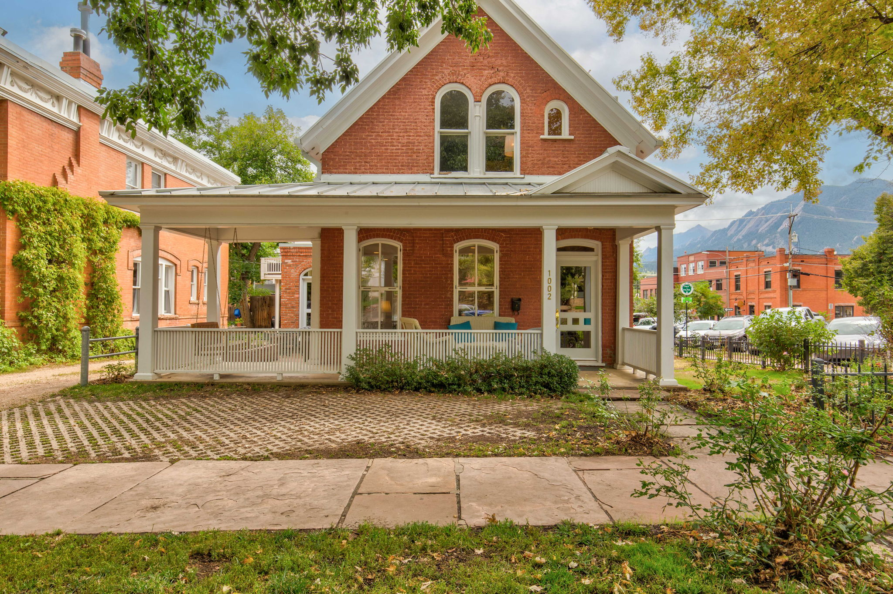
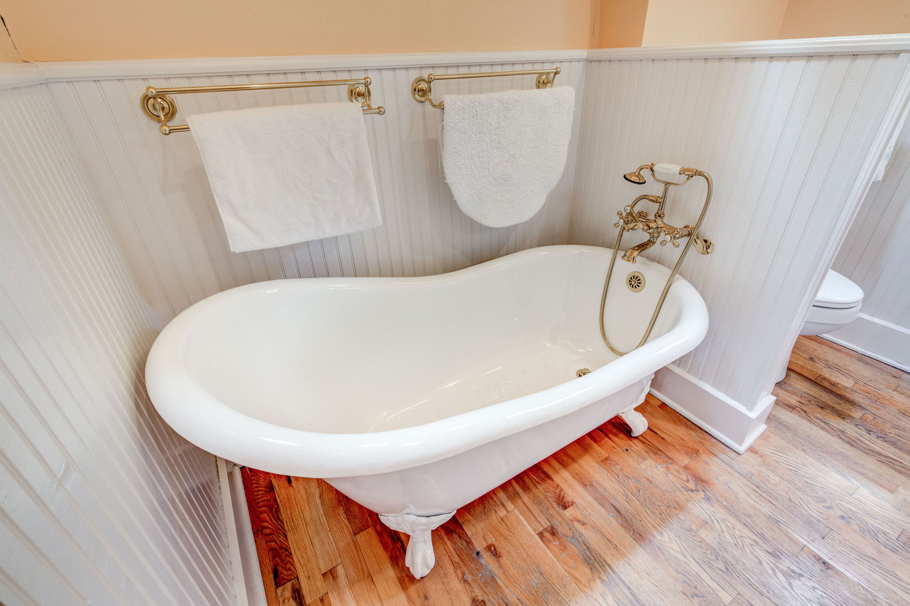
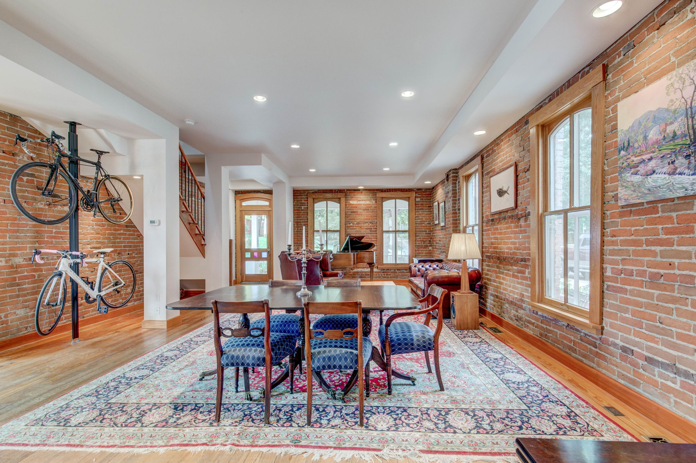
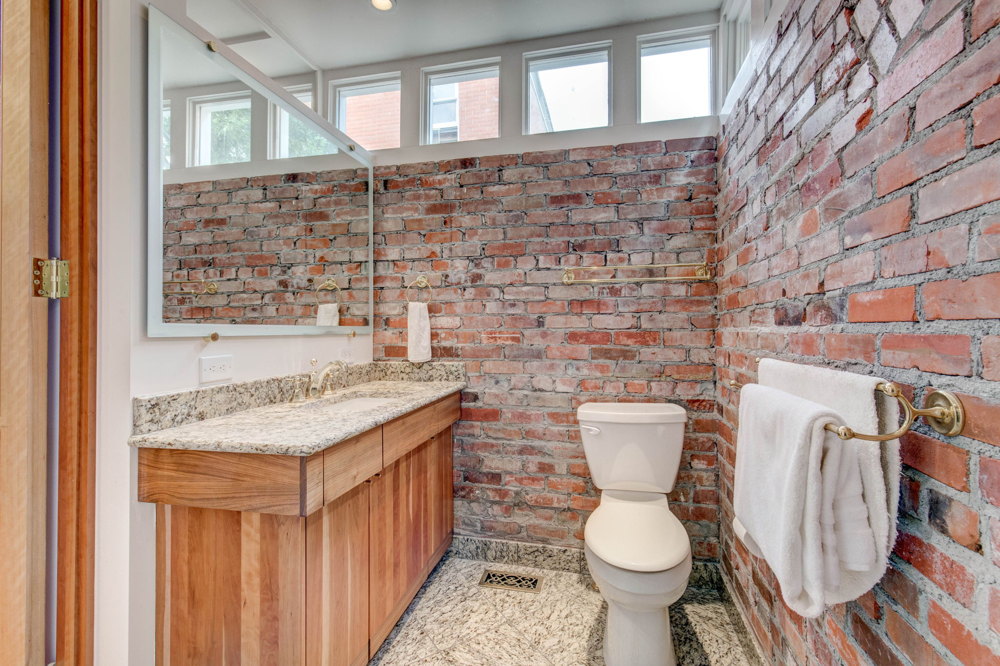

# Charming 1880

Charming 1924 Craftsman located in the desirable North End neighborhood right next to UPS.  Beautifully restored open floor plan with picturesque front porch and fenced backyard. Large deck perfect for entertaining and summer BBQ’s. Original craftsman woodwork and gleaming refinished hardwood floors. Fully remodeled kitchen and laundry on main level. Private upper level master suite. Detached garage and ample storage in basement with separate entry.

Great walkable neighborhood close to 6th Ave shops and restaurants. Close proximity to the Proctor, UPS, Old Town, and Downtown

Amenities
* 3bd/1.75ba
* 1668 sq ft finished, 520 sq ft unfinished basement
* Gas fireplace
* Gas range and stainless steel GE appliances
* LG front loading washer and dryer
* Fenced backyard
* Detached garage
* Brand new hot water heater and furnace

# Links
* [Zillow](https://www.zillow.com/homedetails/1002-Spruce-St-Boulder-CO-80302/13183187_zpid/?view=public)
* [Redfin](https://www.redfin.com/CO/Boulder/1002-Spruce-St-80302/home/35179762)

# Images

