# Restored 1903 Craftsman, Garage and Large Back Yard

Charming 1903 Craftsman with all of the modern conveniences located in the heart of the Central District.  Enjoy city living amidst the privacy of your own backyard retreat and picturesque front porch.  Beautifully restored open floor plan including original, refinished fir flooring and ample storage in a full basement with separate entry. Includes private parking with attached garage and plenty of off-street parking for guests.

Great walkable neighborhood and ideal for commuters:
* The Neighbor Lady, Cortona Cafe, and Uncle Ike’s all within one block.
* Nearby to many grocery stores including Safeway, Trader Joe’s, and Central Co-op
* Easy access to I-5 and I-90
* Convenient to 2, 3, 8, 11, 12, 43, 48 bus lines
* Short bike or bus ride to Downtown and Pike’s Place Market
* Walk to Madrona, Madison Valley, and Capitol Hill

Amenities:
* Gas range
* Granite countertops
* GE stainless steel appliances
* Front loading LG washer and dryer
* Hardwood flooring
* Large, fenced backyard
* Attached garage
* Full basement

Zillow - https://www.zillow.com/homedetails/1122-24th-Ave-Seattle-WA-98122/49024185_zpid/?view=public
Refin - https://www.redfin.com/WA/Seattle/1122-24th-Ave-98122/home/146674
Blog - http://24thandunionrental.blogspot.com/

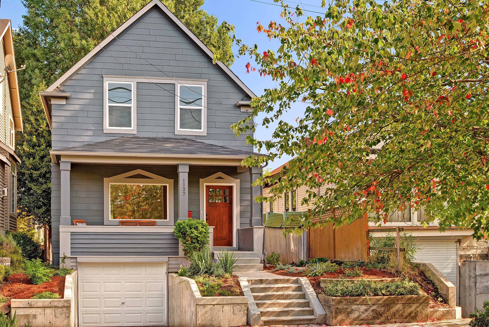
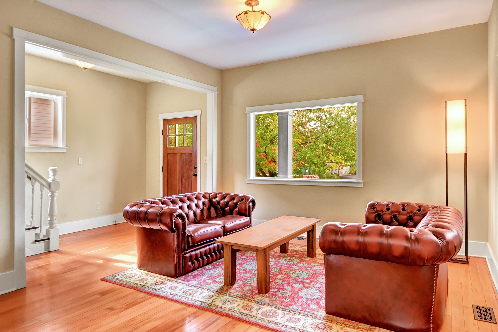
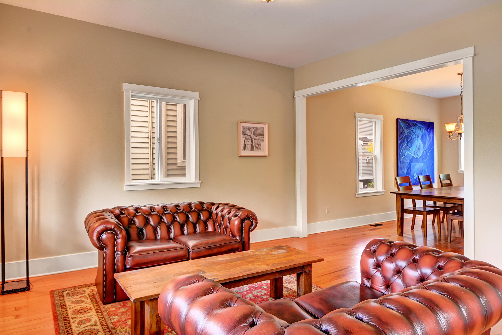
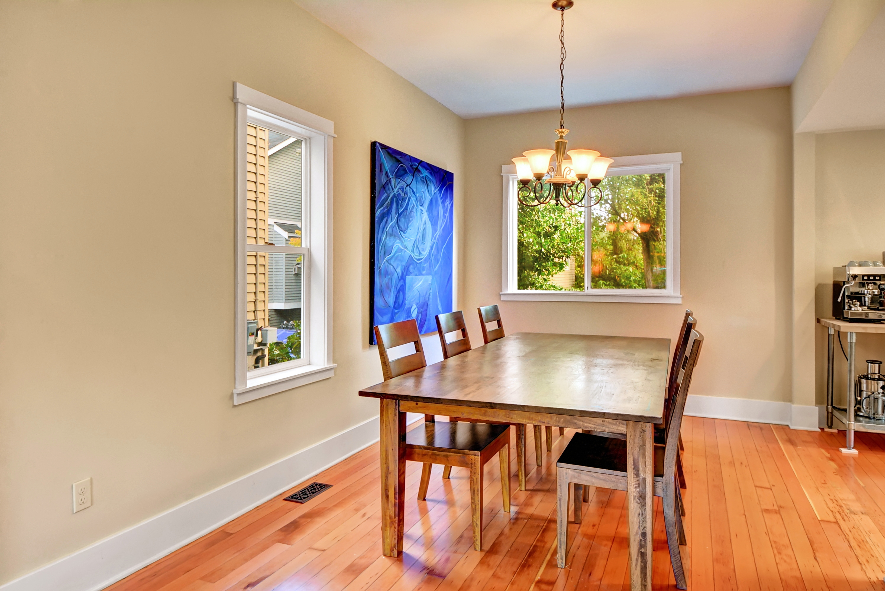
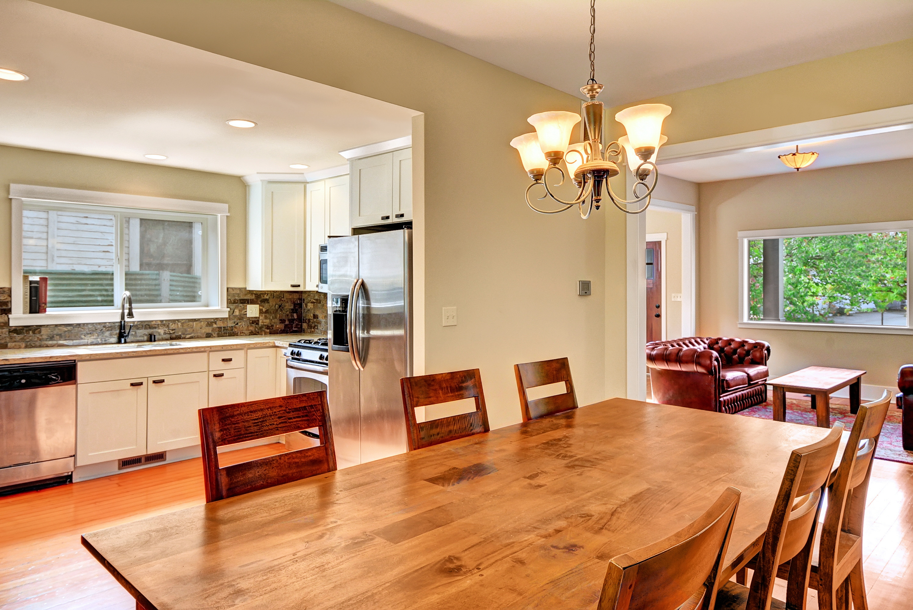
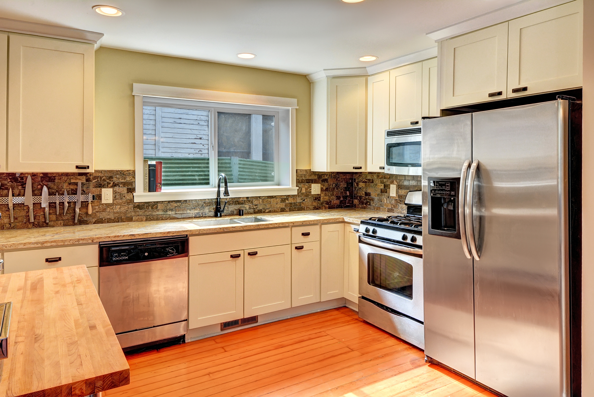
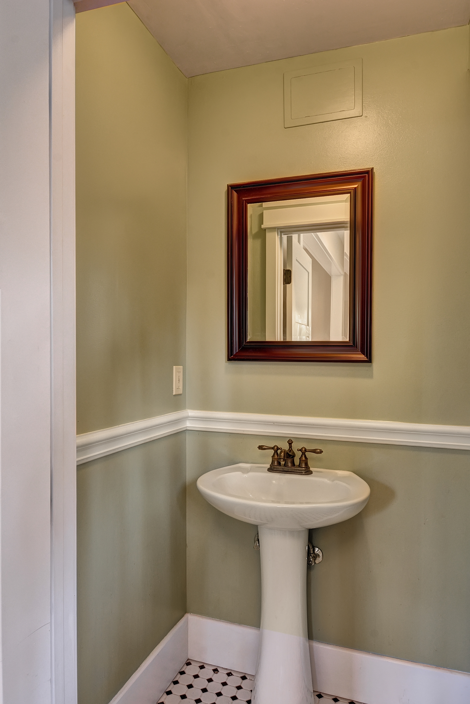
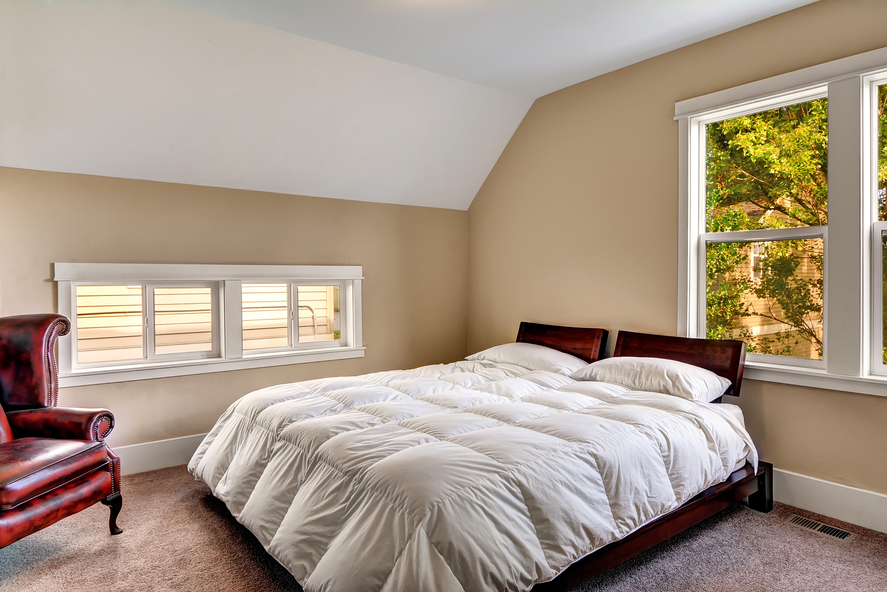
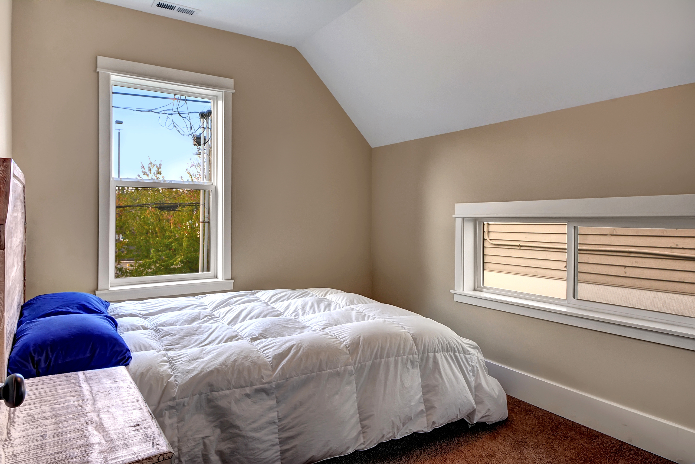
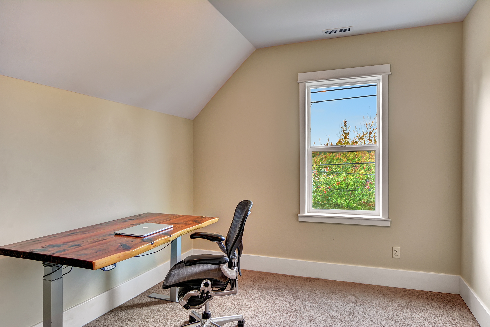
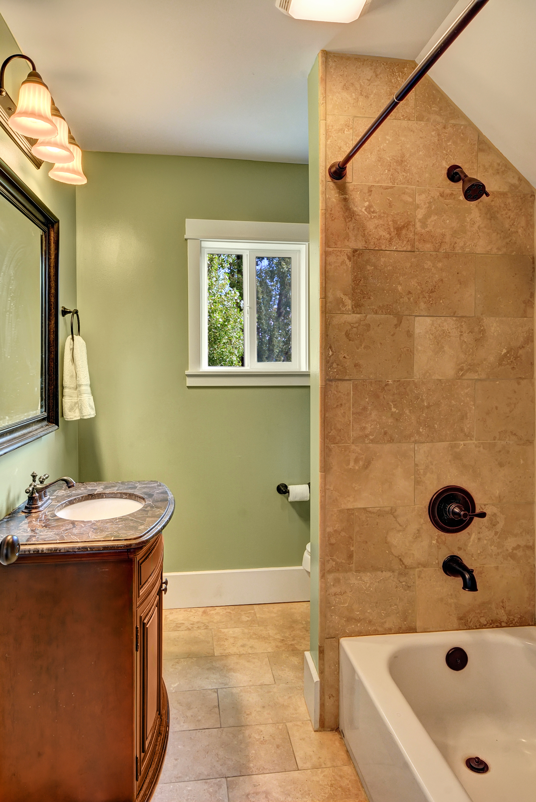
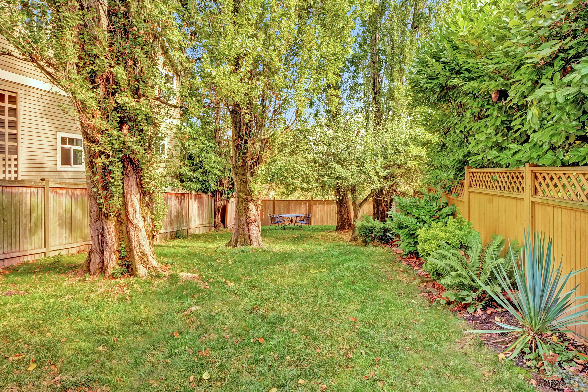
