# Spacious High Rise Condo with Free Parking and Storage Unit

Live in one of Seattle's iconic high-rises, The Meridian.  99 walk score.  Perfectly situated to the lively Pike/Pine corridor, Downtown, Capitol Hill and First Hill.  Luxury amenities in HOA building including 24 hour concierge, fitness center, screening room, clubroom, hot tub, steam room and guest suite.

* 1 bdrm/1 bath - 751 sqft
* 14th floor balcony with sweeping views of Capitol Hill and First Hill
* Hardwood floors, granite countertops and cherry wood cabinets
* Stainless steel appliances - microwave, Miele dishwasher, Kitchen Aid fridge, gas range
* Gas fireplace
* Washer and dryer in unit
* Storage unit
* Secured/underground parking space

Lease price includes HOA dues, gas, water, sewer and trash. Parking and storage included. Tenant is responsible for electricity and cable/internet.

# Links
* [Zillow](https://www.zillow.com/homedetails/1420-Terry-Ave-UNIT-1405-Seattle-WA-98101/60762418_zpid/?view=public)
* [Redfin](https://www.redfin.com/WA/Seattle/1420-Terry-Ave-98101/unit-1405/home/32692)
* [Blog](http://meridiancondorental.blogspot.com/)

# Images
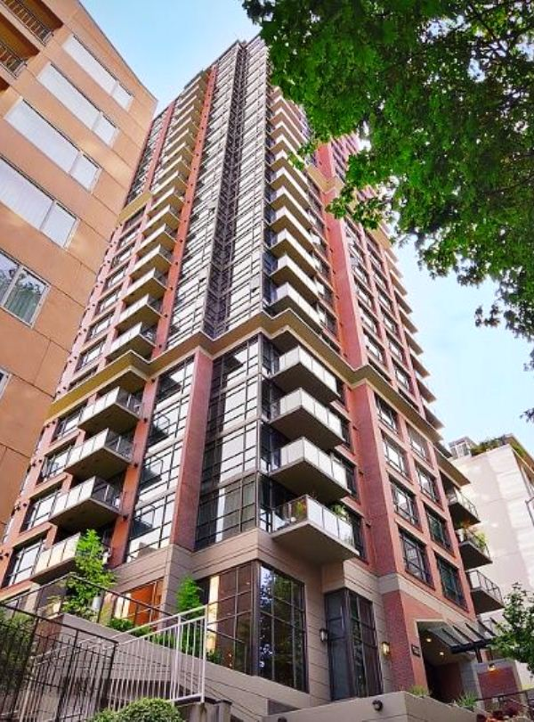
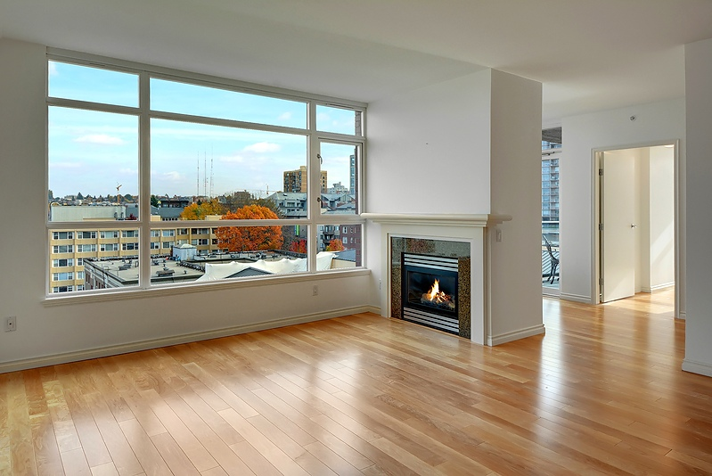
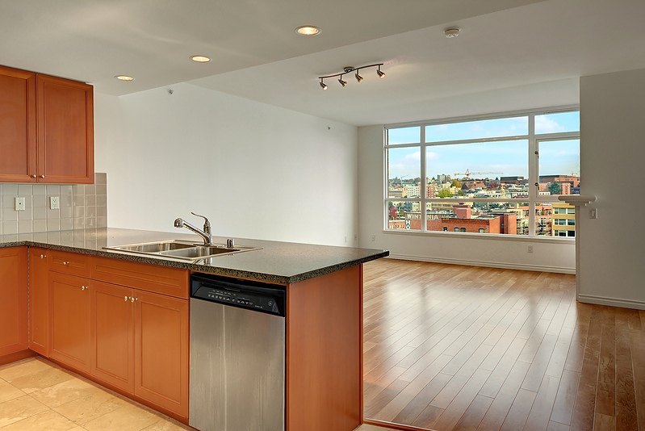
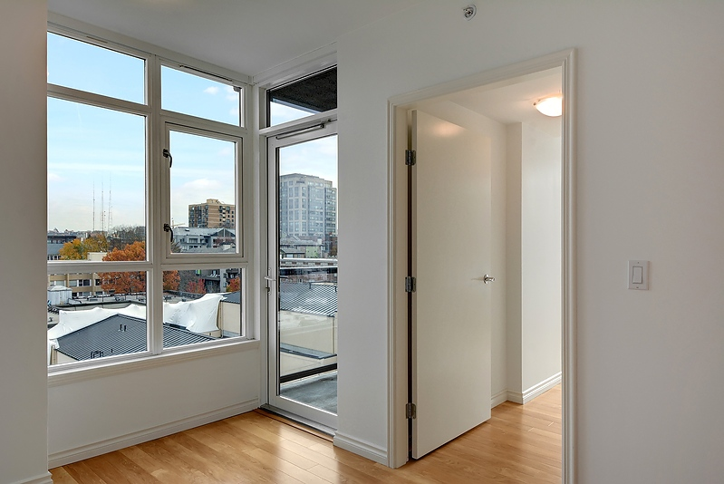
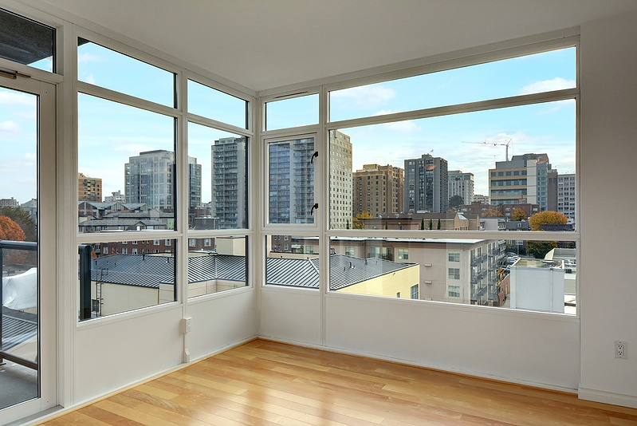
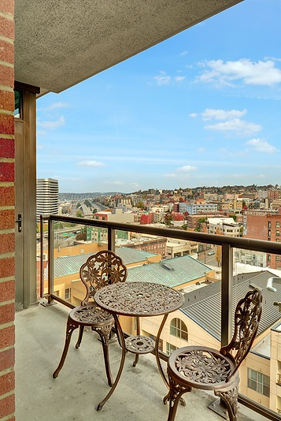
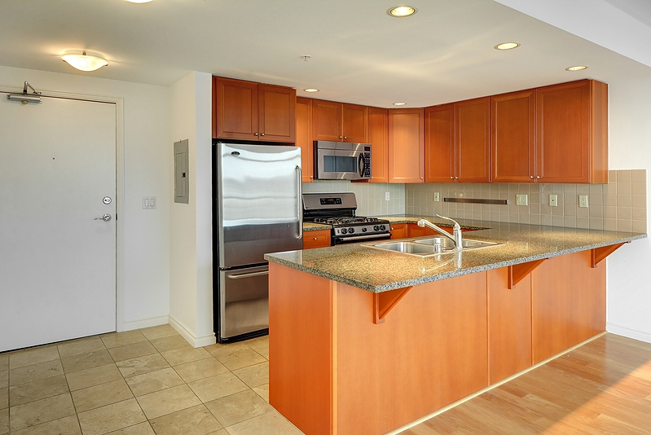
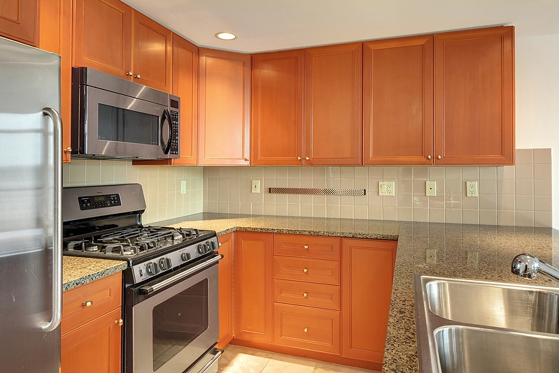
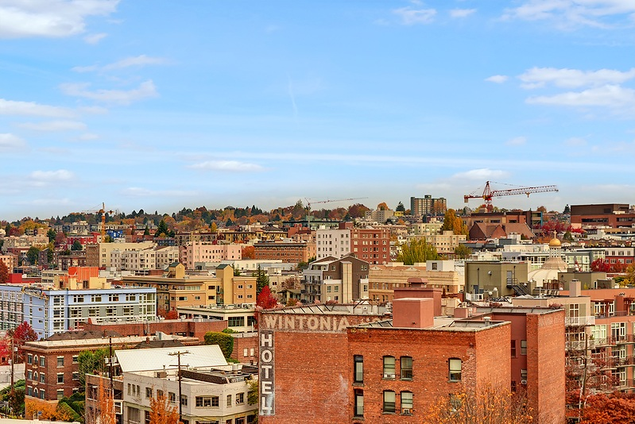
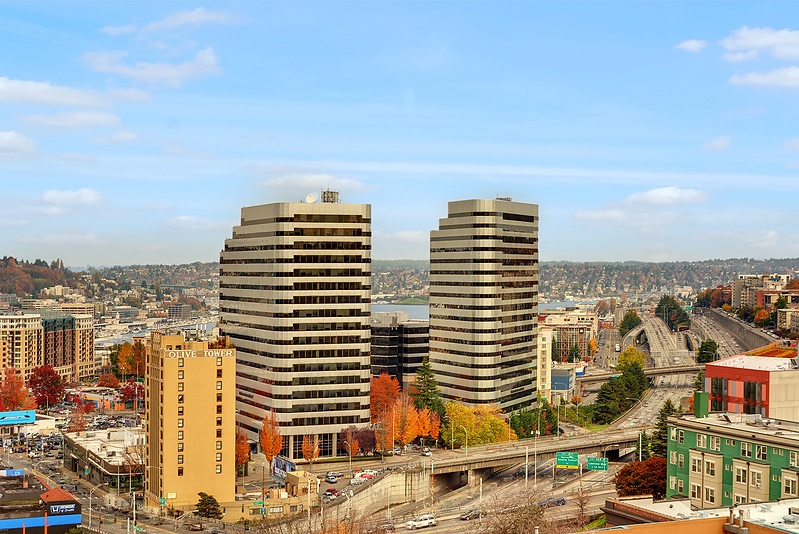
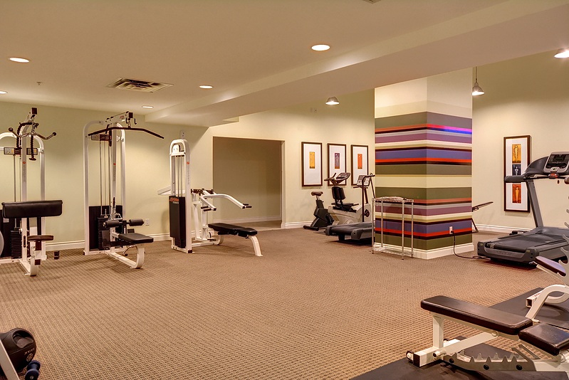
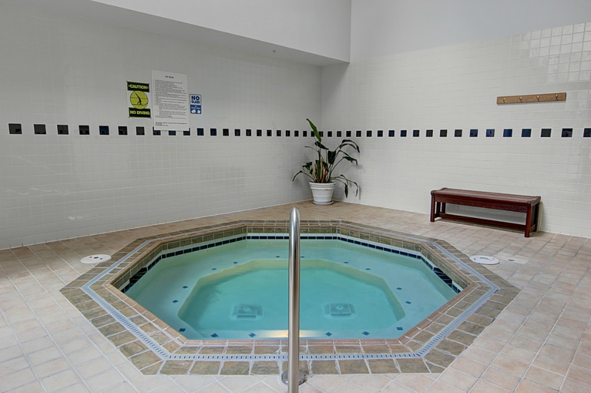
