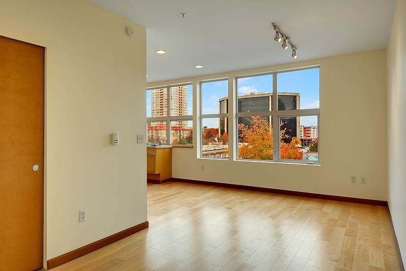

# Historic Updated Studio in the Heart of Belltown, Parking Included

Live the dream! In-city living in this wonderfully updated and spacious studio condo in the heart of Belltown!

Yes, you can have it all!  Old world charm and modern-day advantages! Live in this wonderfully historic Seattle brick building with hardwood floors, while having the conveniences of updated electrical wiring, cable ready, dishwasher and an in-unit washer/dryer!  Not to mention parking... yes, underground/secured parking is included!

What a great location!  Walk to Seattle Art Museum or the Symphony, ride your bike and take in the sights at Sculpture Park, watch the fish fly at the Public Market, shop 'til you drop at all the fantastic downtown shops, or just relax and take in the view on the roof-top deck.

Get to work in minutes by walking or riding your bike to Amazon, Nordstrom, Group Health, Starbucks, Queen Anne, Capitol Hill, South Lake Union or anywhere downtown!

Condo amenities include:

* In-unit washer and dryer
* Hardwood floors
* Updated electrical wiring and cable access
* Separate storage unit
* Under ground/secured parking
* Roof-top deck
* Views of the Space Needle and the Monorail through an entire wall of windows
* Spacious enough for a king size bed
* Sewer, water and trash are all included in rent
* You only pay extra for electricity and internet access

Best of all, there's a Starbucks directly downstairs for that quick morning or afternoon fix!

