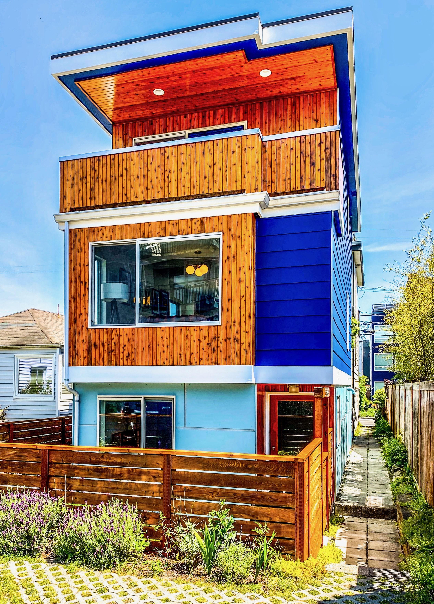
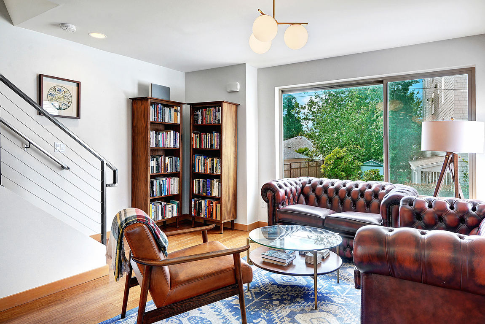
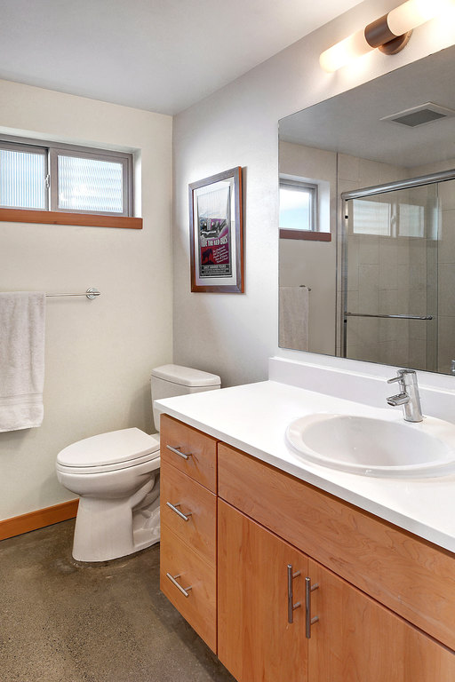
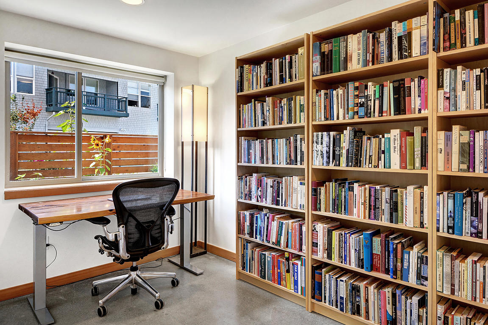
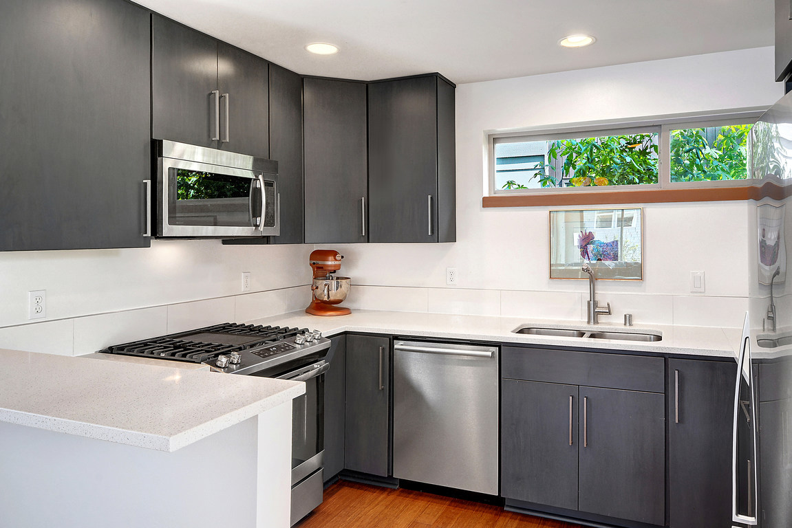
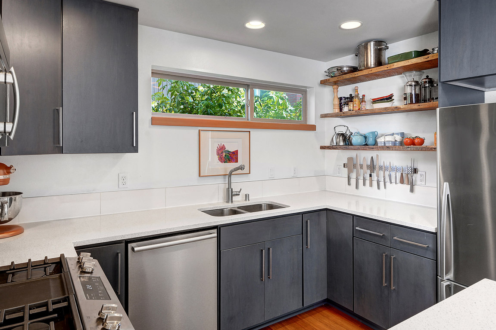
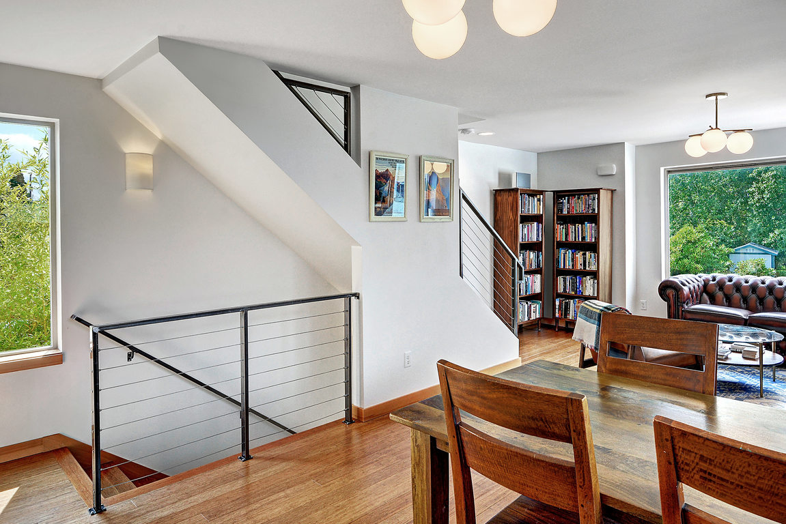
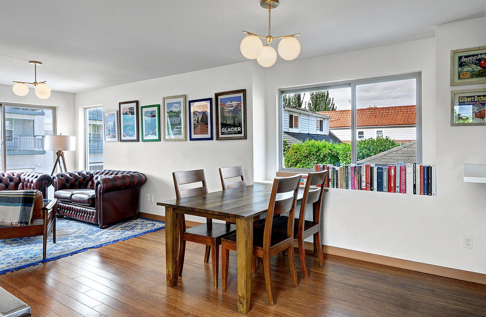

# Alki Beach House

Modern Alki Beach house, a block from Alki Beach Park. Steps from all the fun of Alki, while still private and secluded in your own house with no shared walls. Perfect for outdoor enthusiasts! Take a bike ride or go for a run on the beachside shared use path! Look for sea lions in the Sound while you kayak or paddle board. Steps away to great restaurants and coffee shops. Come live your best life at Alki Beach!

Amenities include:
* 3 bed, 2.25 bath
* 1370 sqft
* Three stories
* Off street parking
* Large, private en-suite master on top floor with attached balcony and walk in closet
* Stainless steel appliances, Bosch dishwasher and gas range
* Radiant floor heating and a tankless water heater for endless showers.
* Garden patio area perfect for a BBQ and to store kayaks

Easily walk to Cactus, Top Pot, Harry's Beach House and Il Nido.  Nearby bus service to Downtown.  Free shuttle to the West Seattle Water Taxi and Admiral Junction.  Convenient to Alaska Junction.  Numerous grocery stores, including Metropolitan Market, PCC Community Market, Safeway and Whole Foods.

# Images

# Links
* [Zillow](https://www.zillow.com/homedetails/3019-63rd-Ave-SW-Seattle-WA-98116/96672117_zpid/?view=public)
* [Redfin](https://www.redfin.com/WA/Seattle/3019-63rd-Ave-SW-98116/home/28581271)
