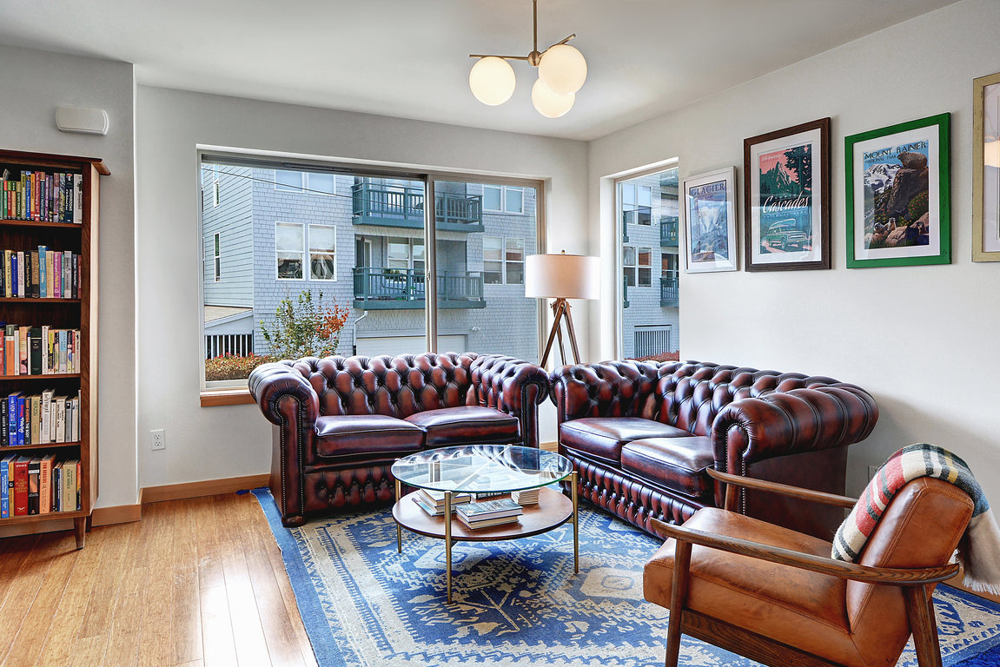

# Alki Beach House

Modern Alki Beach house a block from restaurants and the Sound.  Three stories with a master and bath on the top floor and a private porch.  Ground floor has two bedrooms and another bath.  Bosch dishwasher, gas range.  Radiant floor heating and a tankless water heater for endless showers.  Garden patio area perfect for a BBQ and to store kayaks.

Easily walk to Cactus, Top Pot, Harry's Beach House and Il Nido.  Nearby bus service to Downtown.  Free shuttle to the Alki water taxi and Admiral.

# Images

# Links
* [Zillow](https://www.zillow.com/homedetails/3019-63rd-Ave-SW-Seattle-WA-98116/96672117_zpid/?view=public)
* [Redfin](https://www.redfin.com/WA/Seattle/3019-63rd-Ave-SW-98116/home/28581271)
